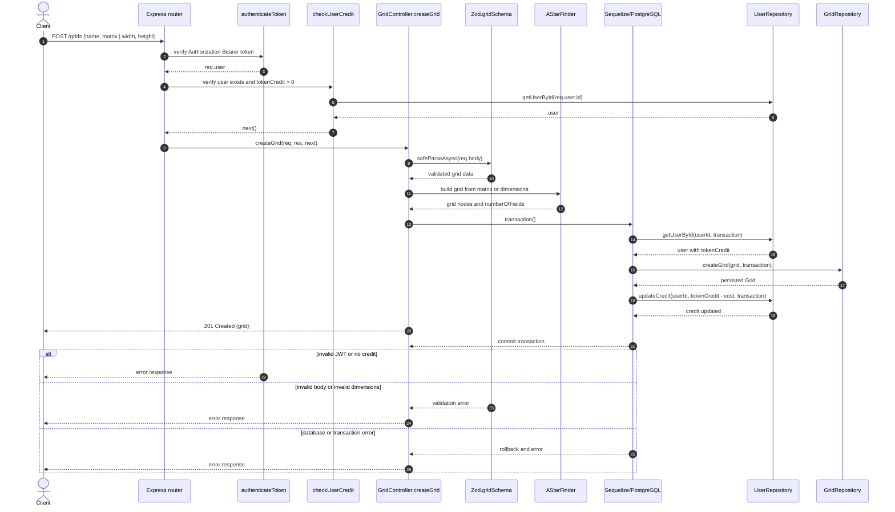
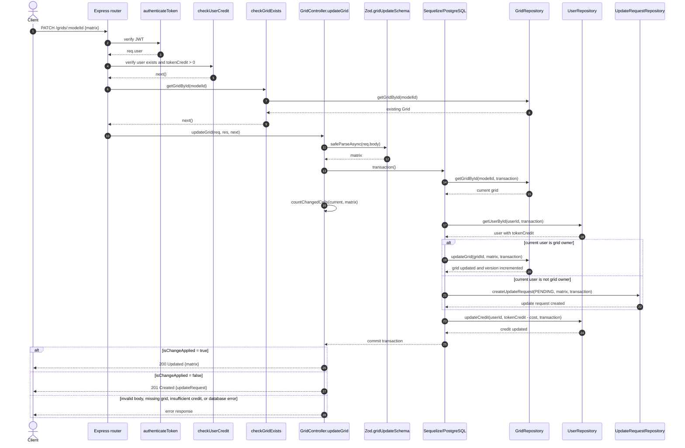
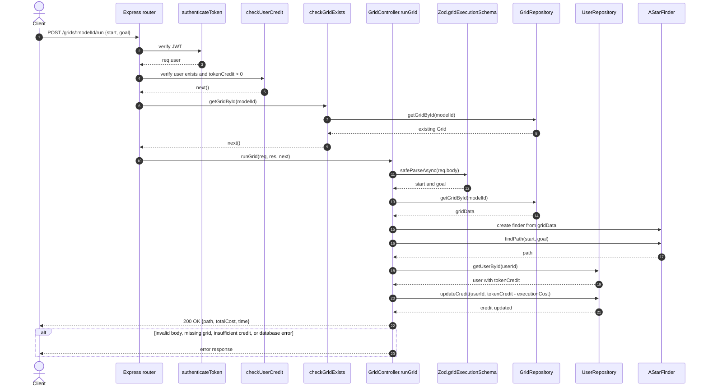

# ProgettoProgrammazioneAvanzata
Repository per progetto del corso Programmazione Avanzata tenuto nell'anno accademico 25/26 all'Università Politecnica delle Marche.. 


# Descrizione del progetto:

Si realizzi un sistema che consenta di gestire la creazione e valutazione di modelli di ricerca del percorso su griglia. In particolare, il sistema deve prevedere la possibilità di gestire l'aggiornamento della matrice (valori di 0 / 1) effettuato da utenti autenticati (mediante JWT). Il progetto simula il concetto del crowd-sourcing dove gli utenti possono contribuire attivamente. Un esempio di applicazione è quello di tenere traccia dei minuti che sono necessari per percorre un determinato tratto di strada. Di seguito il dettaglio di quanto si deve realizzare (tutte le chiamate devono essere autenticate con JWT):

* Dare la possibilità di creare un nuovo modello seguendo l'interfaccia definita nella sezione API di <https://www.npmjs.com/package/astar-typescript> ed in particolare di specificare la griglia con i valori iniziali
  + In particolare, è necessario validare la richiesta di creazione del modello (es. dimensione della griglia)
  + Per ogni modello valido deve essere addebitato un numero di token che è pari a 0.025 moltiplicato il numero di celle della griglia.
  + Il modello può essere creato se c'è credito sufficiente ad esaudire la richiesta.
* Dare la possibilità di aggiornare un modello cambiando il valore da 0 a 1 o da 1 a 0; si distinguano due casi:
  + Utente che fa richiesta di aggiornamento che coincide con l'utente che ha creato il modello
    - In questo caso la richiesta se valida consente di apporre direttamente la modifica
  + Utente che fa richiesta di aggiornamento che NON coincide con l'utente che ha creato il modello
    - In questo caso la richiesta deve essere approvata o rifiutata dall'utente che ha creato il modello.
    - Creare una rotta per approvare o rigettare una data richiesta di aggiornamento
    - Creare una rotta che consenta di approvare o rigettare un batch di richieste di aggiornamento
  + La richiesta di aggiornamento costa 0.3 per ogni cella che si vuole aggiornare; rifiutare se il credito non è sufficiente. L'importo viene sottratto all'utente che sta facendo la richiesta.
* Creare una rotta che dato un modello consenta di restituire l'elenco degli aggiornamenti effettuati nel corso del tempo filtrando opzionalmente per data (inferiore a, superiore a, compresa tra) distinguendo per stato ovvero accettato / rigettato
* Creare una rotta che consenta di verificare lo stato di un modello ovvero se vi è/sono una/più richiesta/e in fase di pending.
* Creare una rotta che consenta di visualizzare tutte le richieste di aggiornamento che sono in fase pending relative a modelli creati dall'utente che si autentica mediante token JWT
* Creare una rotta che consenta di approvare / rigettare la richiesta di aggiornamento di una o più celle della griglia; solo l'utente che ha creato il modello può effettuare tale operazione (l'operazione può essere fatta anche in modalità bulk specificando quali richieste approvare o meno).
* Eseguire un modello fornendo un punto di partenza ed uno di arrivo; per ogni esecuzione deve essere applicato un costo pari a quello addebitato nella fase di creazione. Ritornare il risultato sotto forma di JSON. Il risultato deve anche considerare il tempo impiegato per l'esecuzione. L'esecuzione del modello deve prevedere ovviamente la necessità di specificare start, goal. Ritornare il percorso ed il costo associato a tale percorso (per costo si intende non i termini di token, ma in termini di percorso ottimo sul grafo considerando i pesi).
* Restituire l'elenco degli aggiornamenti di un dato modello eventualmente filtrando per:
  + Data di modifica specificando o la data di fine, o la data di inizio o entrambe.

## Tecnologie utilizzate:
- Node.JS + TypeScript
- Sequelize 
- Postgres
- Docker

# Progettazione

## Use Cases 

## Diagrammi di sequenza

Le route sono esposte con il prefisso configurato da `API_PREFIX` (di default
`/api/v1`). Tutte le route della risorsa `grids` richiedono un token JWT valido
e un credito utente maggiore di zero.

### Create grid

Endpoint: `POST /api/v1/grids`



### Update grid

Endpoint: `PATCH /api/v1/grids/:modelId`

L'utente proprietario modifica direttamente la grid. Un altro utente crea una
richiesta di aggiornamento, che il proprietario potrà approvare o rifiutare in
seguito tramite le route `updateRequests`.



### Run grid

Endpoint: `POST /api/v1/grids/:modelId/run`



### Note

Nel diagramma di `update`, l'aggiornamento del credito avviene all'interno
della stessa transazione del cambio della grid o della creazione della
richiesta. La risposta viene inviata dal controller dopo il commit.

## Pattern utilizzati

### MVC
MVC / Layered Architecture
Il progetto segue una struttura a livelli simile a MVC:

- Routes: definiscono gli endpoint;
- Controllers: gestiscono le richieste;
- Repositories: gestiscono il database;
- Models: rappresentano le entità Sequelize;
- Middleware: gestiscono autenticazione, autorizzazione e validazione;
- DTO: definiscono i dati esposti all’esterno.

### Repository
I repository separano la logica di accesso al database dai controller.
I repository vengono passati ai middleware e ai controller tramite la dependency injection nel costruttore. 
``` typescript
constructor(
  private userRepository: IUserRepository,
  private gridRepository: IGridRepository,
  private updateRequestRepository: IUpdateRequestRepository
) {}
```
Questo rende i controller e middleware più facilmente testabili, perché nei test possono essere passati repository mock.


### Factory Method
Le factory centralizzano la creazione delle risposte.

- ErrorFactory
- SuccessFactory

```typescript
ErrorFactory.createError(
  ErrorTypes.NotFound,
  "User not found"
);
```

```typescript
SuccessFactory.createSuccess(
  SuccessTypes.Created,
  "User registered successfully.",
  user
);
```

In questo modo controller e middleware non devono costruire manualmente ogni risposta.

### Chain of responsability
Express usa una catena di middleware, dove ogni middleware può:

- elaborare la richiesta;
- chiamare next();
- interrompere la catena;
- inoltrare un errore.

```typescript
router.use(
  '/grids',
  authenticateToken,
  checkUserCredit(userRepository),
  gridRoutes
);
```
** Nota: ** alcuni middleware sono stati creati con il pattern Factory.

# Avviare il progetto con Docker

# Test con jest

# Postman