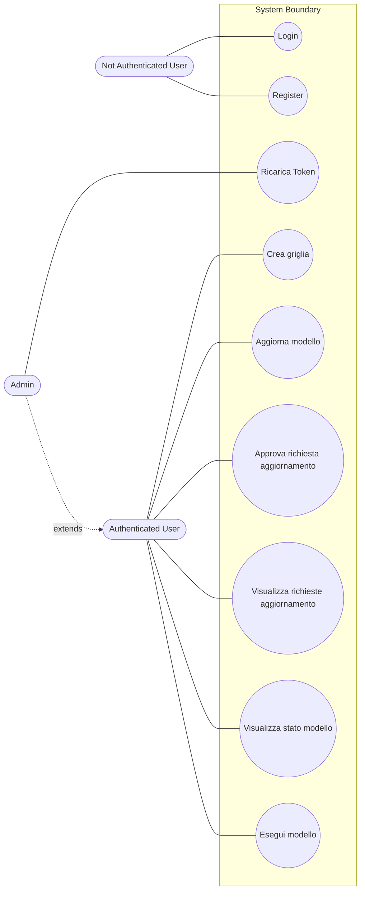
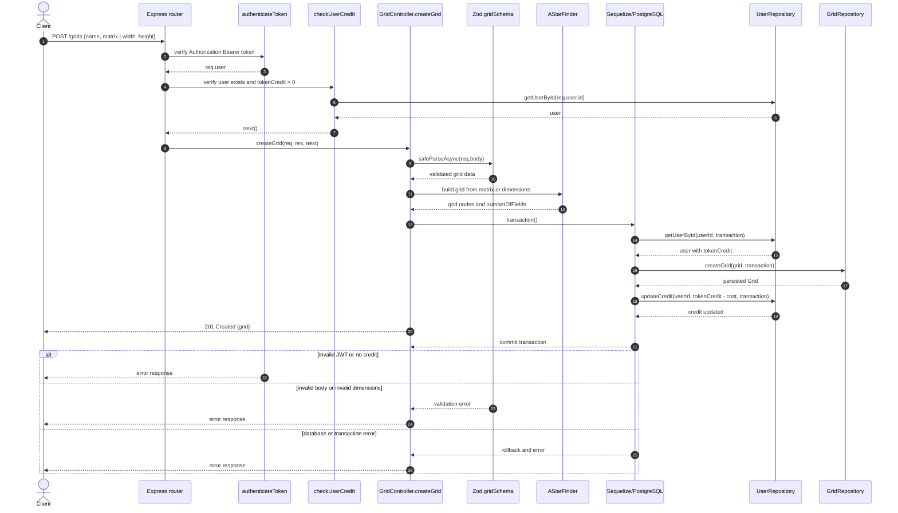
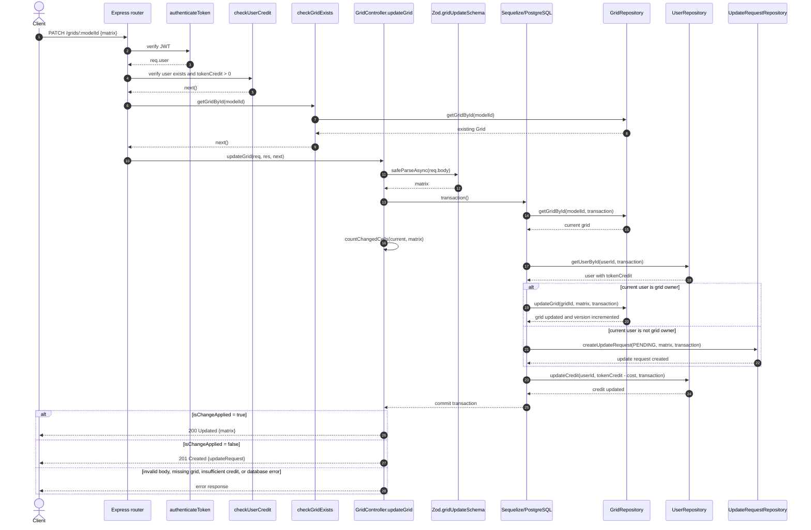
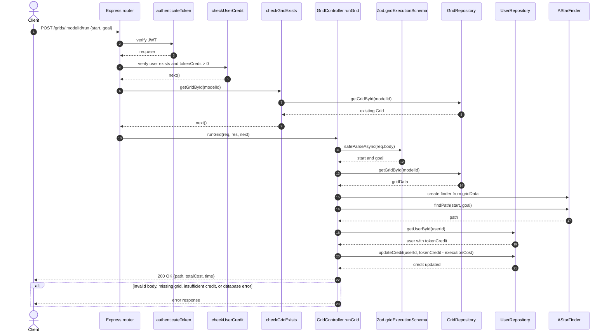

# Progetto Programmazione Avanzata
Repository per progetto del corso Programmazione Avanzata tenuto nell'anno accademico 25/26 all'Università Politecnica delle Marche.. 

## Indice

- [Descrizione del progetto](#descrizione-del-progetto)
- [Tecnologie utilizzate](#tecnologie-utilizzate)
- [Endpoint](#endpoint)
- [Progettazione](#progettazione)
  - [Use Cases](#use-cases)
  - [Diagrammi di sequenza](#diagrammi-di-sequenza)
    - [Create grid](#create-grid)
    - [Update grid](#update-grid)
    - [Run grid](#run-grid)
    - [Note](#note)
- [Pattern utilizzati](#pattern-utilizzati)
  - [MVC / Layered Architecture](#mvc--layered-architecture)
  - [Repository](#repository)
  - [Factory Method](#factory-method)
  - [Chain of responsability](#chain-of-responsability)
- [Avviare il progetto con Docker](#avviare-il-progetto-con-docker)
- [Test con Jest](#test-con-jest)
  - [Test presenti](#test-presenti)
  - [Dipendenze per i test](#dipendenze-per-i-test)
  - [Esecuzione](#esecuzione)
- [Postman](#postman)


# Descrizione del progetto:

Si realizzi un sistema che consenta di gestire la creazione e valutazione di modelli di ricerca del percorso su griglia. In particolare, il sistema deve prevedere la possibilità di gestire l'aggiornamento della matrice (valori di 0 / 1) effettuato da utenti autenticati (mediante JWT). Il progetto simula il concetto del crowd-sourcing dove gli utenti possono contribuire attivamente. Un esempio di applicazione è quello di tenere traccia dei minuti che sono necessari per percorre un determinato tratto di strada. Di seguito il dettaglio di quanto si deve realizzare (tutte le chiamate devono essere autenticate con JWT):

* Dare la possibilità di creare un nuovo modello seguendo l'interfaccia definita nella sezione API di <https://www.npmjs.com/package/astar-typescript> ed in particolare di specificare la griglia con i valori iniziali
  + In particolare, è necessario validare la richiesta di creazione del modello (es. dimensione della griglia)
  + Per ogni modello valido deve essere addebitato un numero di token che è pari a 0.025 moltiplicato il numero di celle della griglia.
  + Il modello può essere creato se c'è credito sufficiente ad esaudire la richiesta.
* Dare la possibilità di aggiornare un modello cambiando il valore da 0 a 1 o da 1 a 0; si distinguano due casi:
  + Utente che fa richiesta di aggiornamento che coincide con l'utente che ha creato il modello
    - In questo caso la richiesta se valida consente di apporre direttamente la modifica
  + Utente che fa richiesta di aggiornamento che NON coincide con l'utente che ha creato il modello
    - In questo caso la richiesta deve essere approvata o rifiutata dall'utente che ha creato il modello.
    - Creare una rotta per approvare o rigettare una data richiesta di aggiornamento
    - Creare una rotta che consenta di approvare o rigettare un batch di richieste di aggiornamento
  + La richiesta di aggiornamento costa 0.3 per ogni cella che si vuole aggiornare; rifiutare se il credito non è sufficiente. L'importo viene sottratto all'utente che sta facendo la richiesta.
* Creare una rotta che dato un modello consenta di restituire l'elenco degli aggiornamenti effettuati nel corso del tempo filtrando opzionalmente per data (inferiore a, superiore a, compresa tra) distinguendo per stato ovvero accettato / rigettato
* Creare una rotta che consenta di verificare lo stato di un modello ovvero se vi è/sono una/più richiesta/e in fase di pending.
* Creare una rotta che consenta di visualizzare tutte le richieste di aggiornamento che sono in fase pending relative a modelli creati dall'utente che si autentica mediante token JWT
* Creare una rotta che consenta di approvare / rigettare la richiesta di aggiornamento di una o più celle della griglia; solo l'utente che ha creato il modello può effettuare tale operazione (l'operazione può essere fatta anche in modalità bulk specificando quali richieste approvare o meno).
* Eseguire un modello fornendo un punto di partenza ed uno di arrivo; per ogni esecuzione deve essere applicato un costo pari a quello addebitato nella fase di creazione. Ritornare il risultato sotto forma di JSON. Il risultato deve anche considerare il tempo impiegato per l'esecuzione. L'esecuzione del modello deve prevedere ovviamente la necessità di specificare start, goal. Ritornare il percorso ed il costo associato a tale percorso (per costo si intende non i termini di token, ma in termini di percorso ottimo sul grafo considerando i pesi).
* Restituire l'elenco degli aggiornamenti di un dato modello eventualmente filtrando per:
  + Data di modifica specificando o la data di fine, o la data di inizio o entrambe.

## Tecnologie utilizzate:
- Node.JS + TypeScript
- Sequelize 
- Postgres
- Docker

## Endpoint

Il prefisso predefinito per tutte le route è `/api/v1` e può essere modificato
tramite la variabile d'ambiente `API_PREFIX`. Le route protette richiedono un
token JWT nell'header `Authorization: Bearer <token>`.

| Metodo | Endpoint | Autorizzazione | Descrizione |
|---|---|---|---|
| `GET` | `/api/v1/health` | Nessuna | Verifica che il server sia attivo. |
| `POST` | `/api/v1/auth/register` | Nessuna | Registra un nuovo utente. |
| `POST` | `/api/v1/auth/login` | Nessuna | Autentica un utente e restituisce il token JWT. |
| `POST` | `/api/v1/grids` | JWT + credito positivo | Crea un nuovo modello di griglia a partire da una matrice o dalle sue dimensioni, addebitando il costo previsto. |
| `PATCH` | `/api/v1/grids/:modelId` | JWT + credito positivo | Aggiorna una griglia; il proprietario applica la modifica direttamente, mentre gli altri utenti creano una richiesta di aggiornamento. |
| `POST` | `/api/v1/grids/:modelId/run` | JWT + credito positivo | Esegue il modello tra un punto di partenza e uno di arrivo e restituisce percorso, costo del percorso e tempo di esecuzione. |
| `GET` | `/api/v1/updateRequests/:modelId/updates` | JWT | Restituisce le richieste di aggiornamento accettate o rifiutate di una griglia, con filtri temporali opzionali. |
| `GET` | `/api/v1/updateRequests/:modelId/status` | JWT | Verifica se una griglia ha richieste di aggiornamento in stato `pending`. |
| `GET` | `/api/v1/updateRequests/pending` | JWT | Restituisce le richieste `pending` relative ai modelli creati dall'utente autenticato. |
| `PATCH` | `/api/v1/updateRequests/:id` | JWT | Approva o rifiuta una richiesta di aggiornamento specifica. |
| `PATCH` | `/api/v1/updateRequests/:id/updateCells` | JWT | Approva o rifiuta l'aggiornamento di una o più celle di una richiesta specifica. |
| `PATCH` | `/api/v1/updateRequests/batch` | JWT | Approva o rifiuta in modalità bulk più richieste di aggiornamento. |
| `PATCH` | `/api/v1/users/:id/credits` | JWT + ruolo admin | Aggiorna il credito dell'utente indicato; l'operazione è riservata agli amministratori. |

# Progettazione

## Use Cases 

## Diagrammi di sequenza

Le route sono esposte con il prefisso configurato da `API_PREFIX` (di default
`/api/v1`). Tutte le route della risorsa `grids` richiedono un token JWT valido
e un credito utente maggiore di zero.

### Create grid

Endpoint: `POST /api/v1/grids`



### Update grid

Endpoint: `PATCH /api/v1/grids/:modelId`

L'utente proprietario modifica direttamente la grid. Un altro utente crea una
richiesta di aggiornamento, che il proprietario potrà approvare o rifiutare in
seguito tramite le route `updateRequests`.



### Run grid

Endpoint: `POST /api/v1/grids/:modelId/run`



### Note

Nel diagramma di `update`, l'aggiornamento del credito avviene all'interno
della stessa transazione del cambio della grid o della creazione della
richiesta. La risposta viene inviata dal controller dopo il commit.

## Pattern utilizzati

### MVC / Layered Architecture
Il progetto segue una struttura a livelli simile a MVC:

- Routes: definiscono gli endpoint;
- Controllers: gestiscono le richieste;
- Repositories: gestiscono il database;
- Models: rappresentano le entità Sequelize;
- Middleware: gestiscono autenticazione, autorizzazione e validazione;
- DTO: definiscono i dati esposti all’esterno.

### Repository
I repository separano la logica di accesso al database dai controller.
I repository vengono passati ai middleware e ai controller tramite la dependency injection nel costruttore. 
``` typescript
constructor(
  private userRepository: IUserRepository,
  private gridRepository: IGridRepository,
  private updateRequestRepository: IUpdateRequestRepository
) {}
```
Questo rende i controller e middleware più facilmente testabili, perché nei test possono essere passati repository mock.


### Factory Method
Le factory centralizzano la creazione delle risposte.

- ErrorFactory
- SuccessFactory

```typescript
ErrorFactory.createError(
  ErrorTypes.NotFound,
  "User not found"
);
```

```typescript
SuccessFactory.createSuccess(
  SuccessTypes.Created,
  "User registered successfully.",
  user
);
```

In questo modo controller e middleware non devono costruire manualmente ogni risposta.

### Chain of responsability
Express usa una catena di middleware, dove ogni middleware può:

- elaborare la richiesta;
- chiamare next();
- interrompere la catena;
- inoltrare un errore.

```typescript
router.use(
  '/grids',
  authenticateToken,
  checkUserCredit(userRepository),
  gridRoutes
);
```
**Nota:** alcuni middleware sono stati creati con il pattern Factory.

# Avviare il progetto con Docker

Il progetto è configurato per essere eseguito tramite Docker Compose, in modo da avviare contemporaneamente:

- il backend Node.js/TypeScript;
- il database PostgreSQL;
- le variabili di ambiente necessarie per l'applicazione.

La configurazione è definita in `docker-compose.yaml`, mentre l'immagine dell'applicazione viene costruita dal `Dockerfile` presente alla radice del repository.

## Struttura dei servizi

### `app`

Il servizio `app` costruisce l'immagine del backend partendo dal `Dockerfile` e espone la porta configurata tramite la variabile `PORT` (di default `3000`).

Durante l'avvio, il container riceve le seguenti variabili d'ambiente:

- `PORT`: porta HTTP del backend;
- `DB_HOST`: host del database, impostato su `postgres` all'interno della rete Docker;
- `DB_NAME`: nome del database PostgreSQL;
- `DB_USER`: utente del database;
- `DB_PASSWORD`: password del database;
- `JWT_PRIVATE_KEY`: chiave privata usata per firmare i JWT;
- `JWT_PUBLIC_KEY`: chiave pubblica usata per verificare i token.

Il container dipende dal servizio `postgres` e attende che il database sia pronto tramite un health check.

### `postgres`

Il servizio `postgres` usa l'immagine ufficiale `postgres:18` e crea un database iniziale con le credenziali definite nelle variabili di ambiente.

Per persistenza dei dati viene usato un volume Docker chiamato `postgres_data`, in modo che i dati del database rimangano disponibili anche dopo lo stop e il riavvio dei container.

## Avvio rapido

Per costruire e avviare tutti i servizi:

```bash
docker compose up --build
```

Per arrestare i container:

```bash
docker compose down
```

Per eliminare anche i dati persistenti del database:

```bash
docker compose down -v
```

## Nota importante

Prima di avviare Docker, assicurarsi che il file `.env` contenga tutte le variabili richieste dal progetto, in particolare quelle relative al database e ai JWT, perché `docker-compose.yaml` le legge dall'ambiente locale.

Questo setup rende il deploy locale semplice e riproducibile, evitando di dover configurare manualmente il backend e il database sul proprio host.

Per eseguire il seed del database all'interno del container del web service, lanciare il comando: 

```docker
docker exec -it progettoprogrammazioneavanzata-app-1 sh -c "npm run seed"     
```

# Test con jest

Il progetto utilizza **Jest** per eseguire test unitari sui middleware Express.
I test non richiedono l'avvio del server, Docker o una connessione a PostgreSQL:
le dipendenze dei middleware vengono sostituite con repository mockati tramite
`jest.fn()`.

## Test presenti

- `test/grid.test.ts`: verifica il middleware `checkGridExists`. Controlla che
  l'ID del modello venga letto dai parametri della richiesta, che il repository
  venga chiamato con l'ID corretto e che `next()` venga invocato quando la griglia
  esiste.
- `test/user.test.ts`: verifica il middleware `checkUserCredit`. Controlla che
  venga cercato l'utente autenticato tramite `req.user.id`, che il credito venga
  letto dal repository e che `next()` venga invocato quando il credito è positivo.

Entrambi i test usano i tipi `Request`, `Response` e `NextFunction` di Express e
le interfacce `IGridRepository` e `IUserRepository` per costruire mock compatibili
con le dipendenze reali. Le chiamate asincrone dei repository sono simulate con
`mockResolvedValue`.

### Dipendenze per i test

Le principali dipendenze coinvolte sono:

- `jest`: framework di test e API per le asserzioni e i mock;
- `@types/jest`: definizioni TypeScript per `describe`, `it`, `expect` e `jest`;
- `babel-jest`: integrazione tra Jest e Babel;
- `@babel/core`, `@babel/preset-env` e `@babel/preset-typescript`: trasformano i
  file TypeScript in codice eseguibile da Jest;
- `@types/express`: definizioni TypeScript utilizzate nei test per i tipi delle
  richieste, risposte e funzioni `next`.

La configurazione si trova in `jest.config.cjs`: l'ambiente è `node`, vengono
cercati i file `*.test.ts` nella cartella `test` e ogni file TypeScript viene
trasformato da `babel-jest`.

### Esecuzione

Eseguire tutti i test:

```bash
npm test
```

Eseguire un singolo file di test:

```bash
npx jest test/grid.test.ts
npx jest test/user.test.ts
```

I test possono essere eseguiti indipendentemente dal database perché verificano
solo il comportamento dei middleware e simulano le risposte dei repository.


# Postman

Nella cartella `postman` sono presenti una collection e un environment per testare facilmente il backend tramite Postman.

## Collection

Il file `postman/ProgettoProgrammazioneAvanzata.postman_collection.json` contiene i request principali dell'API, tra cui:

- login di amministratore e utenti;
- health check del server;
- creazione e aggiornamento di griglie;
- esecuzione di un modello;
- gestione delle richieste di aggiornamento;
- controllo di stato e pending updates;
- aggiornamento del credito utente riservato all'admin.

## Variabili di ambiente

Il file `postman/ProgettoProgrammazioneAvanzataEnv.postman_environment.json` definisce le variabili utili per eseguire i test in locale:

- `BASE_URI`: base URL del backend (default: `http://localhost`);
- `PORT`: porta del server (default: `3000`);
- `JWT_TOKEN_ADMIN`: token JWT ottenuto tramite login admin;
- `JWT_TOKEN_USER`: token JWT ottenuto tramite login utente.

## Come usarla

1. Aprire Postman e importare la collection presente in `postman/ProgettoProgrammazioneAvanzata.postman_collection.json`.
2. Importare anche l'environment in `postman/ProgettoProgrammazioneAvanzataEnv.postman_environment.json`.
3. Avviare il backend del progetto in locale.
4. Eseguire prima il request di login admin o login user per ottenere il JWT e popolare automaticamente la variabile di ambiente.
5. Se necessario, aggiornare manualmente `BASE_URI` e `PORT` in base alla configurazione del progetto.
6. Eseguire gli altri endpoint della collection usando i token generati dal login.

> Nota: alcuni endpoint richiedono autenticazione JWT e, in alcuni casi, privilegi di admin. Per questo motivo è utile usare prima i request di login dedicati e poi eseguire le chiamate successive con il token corretto.

> Nota: alcune richieste http sono duplicate al fine di creare un flusso di esecuzione della collection per la dimostrazione della demo.

La maggior parte delle richieste http in postman fa uso di script e di variabili di ambiente e di collection per automatizzare l'esecuzione della collection. Alcuni esempi sono: 

Rotta `api/v1/auth/register`: 
- Before request: 
```javascript
// Genera e salva username random
const randomName = pm.variables.replaceIn("{{$randomFullName}}");
pm.collectionVariables.set("saved_username", randomName);

// Genera e salva password random
const randomPass = pm.variables.replaceIn("{{$randomPassword}}");
pm.collectionVariables.set("saved_password", randomPass);
```

- After response: 
```javascript
// Legge il JSON di risposta
const jsonData = pm.response.json();

// Salva l'ID in una variabile di collezione (sostituisci "id" con il nome reale del campo nel tuo JSON)
pm.collectionVariables.set("lastUserIdCreated", jsonData.data.id);
```

e nel body della richiesta utilizzo le variabili di collezione: 
```json
{
  "username": "{{saved_username}}",
  "password": "{{saved_password}}"
}
```

Lo stesso body poi viene utilizzato nella rotta di login per un utente. 

Rotta `api/v1/grids`: 
- Before request: 
```javascript
// 1. Genera dimensioni casuali tra 1 e 10
const rows = Math.floor(Math.random() * 10) + 1;
const cols = Math.floor(Math.random() * 10) + 1;

// 2. Crea la matrice 2D con valori binari (0 o 1)
let matrix = [];
for (let i = 0; i < rows; i++) {
    let row = [];
    for (let j = 0; j < cols; j++) {
        // Genera 0 o 1 casualmente
        row.push(Math.round(Math.random()));
    }
    matrix.push(row);
}

// 3. Salva la matrice come stringa JSON nella variabile di collezione
pm.collectionVariables.set("random_matrix", JSON.stringify(matrix));
```
In questo modo la griglia viene creata in automatico e salvata in una collection variable. 

- After response: 
```javascript
const jsonData = pm.response.json();

pm.collectionVariables.set("lastModelIdCreated", jsonData.data.id);
```
In questo modo imposto in una collection variable il nuovo id creato in modo da poterlo usare nei parametri di altre richieste http.

Nel body della richiesta: 
```json
{
    "name": "matrice_{{$randomAlphaNumeric}}{{$randomAlphaNumeric}}{{$randomAlphaNumeric}}",
    "matrix": {{random_matrix}}
}
```
Anche qui, vengono usate delle funzioni di postman per creare un nuovo nome casuale alla griglia creata.

In fase di sviluppo del backend sono stati fatti dei test facendo run della collection con le chiamate http nel seguente ordine: 
| Metodo | Nome della richiesta |
| :--- | :--- |
| **GET** | Check health |
| **POST** | Register |
| **POST** | Login user x |
| **POST** | Login admin |
| **PATCH** | Admin update credit |
| **POST** | Create Grid |
| **POST** | Run a model |
| **POST** | Login user y |
| **PATCH** | Update Grid |
| **POST** | Login user x 2 |
| **GET** | Get pending update request of current user |
| **PATCH** | Update request |
| **GET** | Get update request by specific model id |