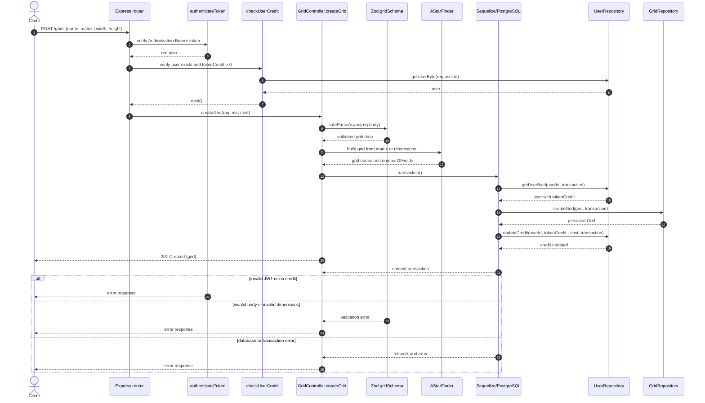
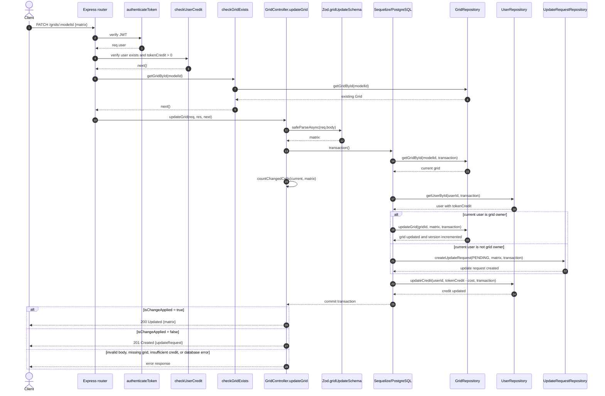
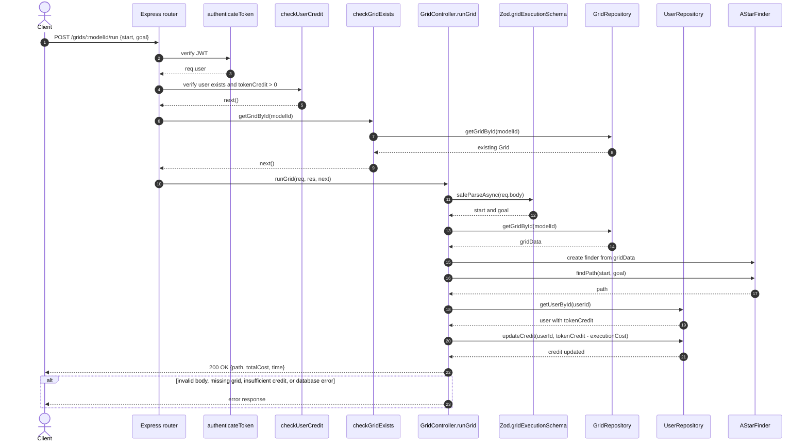

# ProgettoProgrammazioneAvanzata
Repository per progetto del corso Programmazione Avanzata tenuto nell'anno accademico 25/26 all'Università Politecnica delle Marche.. 

# Use Cases 

# Grid Sequence Diagrams

Le route sono esposte con il prefisso configurato da `API_PREFIX` (di default
`/api/v1`). Tutte le route della risorsa `grids` richiedono un token JWT valido
e un credito utente maggiore di zero.

## Create grid

Endpoint: `POST /api/v1/grids`

## Update grid

Endpoint: `PATCH /api/v1/grids/:modelId`

L'utente proprietario modifica direttamente la grid. Un altro utente crea una
richiesta di aggiornamento, che il proprietario potrà approvare o rifiutare in
seguito tramite le route `updateRequests`.

## Run grid

Endpoint: `POST /api/v1/grids/:modelId/run`

## Note

Nel diagramma di `update`, l'aggiornamento del credito avviene all'interno
della stessa transazione del cambio della grid o della creazione della
richiesta. La risposta viene inviata dal controller dopo il commit.
